# Visualização Computacional de Moléculas

**Observações:**

- Este tutorial foi construído ***apenas para fins didáticos***. <span style="color:red">**A reprodução dele para qualquer outro fim não é permitida e nem consentida.**</span>


## Estruturas de Proteínas

O objetivo deste tutorial é visualizar os níveis de arquitetura das proteínas junto com os principais comandos básicos do [UCSF Chimera](https://www.cgl.ucsf.edu/chimera/), que será um dos principais programas que iremos utilizar durante a disciplina.

### Instalação e execução do UCSF Chimera

#### Linux

UCSF Chimera é um programa bastante versátil para a visualização e edição de moléculas pequenas e macromoléculas. Para instalar será necessário baixar o programa em:
[https://www.cgl.ucsf.edu/chimera/download.html](https://www.cgl.ucsf.edu/chimera/download.html). 

- Após baixar, vá ao terminal e vá até a pasta onde o arquivo de instalação foi baixado (normalmente a pasta Downloads).
 
```shell
cd Downloads
chmod a+x chimera-1.17.3-linux_x86_64.bin 
```
> *Pode ser que a versão do programa mude, fique atento.*
 
Agora basta executar para instalar:
 
```shell
sudo ./chimera-1.17.3-linux_x86_64.bin
```
 
- Vão aparecer algumas perguntas, basta pressionar ```Enter```, mas uma em especial garante que o programa fique fácil de executar:

```shell
Install symbolic link to chimera executable for command line use in which directory?
```

- Escolha a opção 2 ```- /usr/local/bin```, se você usar o Ubuntu ou similar.
- Responda ***Yes*** para instalar a opção de atalho no desktop.
 
Para executar o UCSF Chimera, basta clicar no atalho criado no desktop ou digitar no terminal o seguinte comando:

```shell
chimera
```

##### Instalando sem privilégios de root:

Para usar o comando ```sudo```você precisará de permissão. Caso não tenha, você pode continuar a instalação sem ele. Após fazer o download do UCSF Chimera e tornar o arquivo executável (de acordo com os primeiros passos acima), execute o instalador:

```shell
./chimera-1.17.3-linux_x86_64.bin
```
- Direcione a instalação para uma pasta dentro da sua ```home```
- Responda ***No*** para a pergunta abaixo:

```sehll
Install symbolic link to chimera executable for command line use in which directory?
```
- Responda ***Yes*** para instalar a opção de atalho no desktop.

Desta forma, você só conseguirá executar o UCSF Chimera pelo ícone da área de trabalho, ou descrevendo o caminho inteiro do executável.

#### Ambientes Windows ou MacOS

Instaladores para ambos os sistemas estão disponíveis na página de Download do UCSF Chimera. Após o download, dê um duplo clique e siga as instruções de instalação.

> *Para instalar no Windows sem privilégios de usuário administrador, basta direcionar a pasta de instalação do UCSF Chimera para uma pasta do seu usuário.*

## Noções Básicas de Visualização computacional de moléculas

Tendo o UCSF Chimera instalado, começaremos pela visualização da molécula de água. Para isso faremos o seguinte:

- Abra o USCF Chimera.
- Ao abrir o programa, uma tela semelhante a abaixo deverá aparecer:

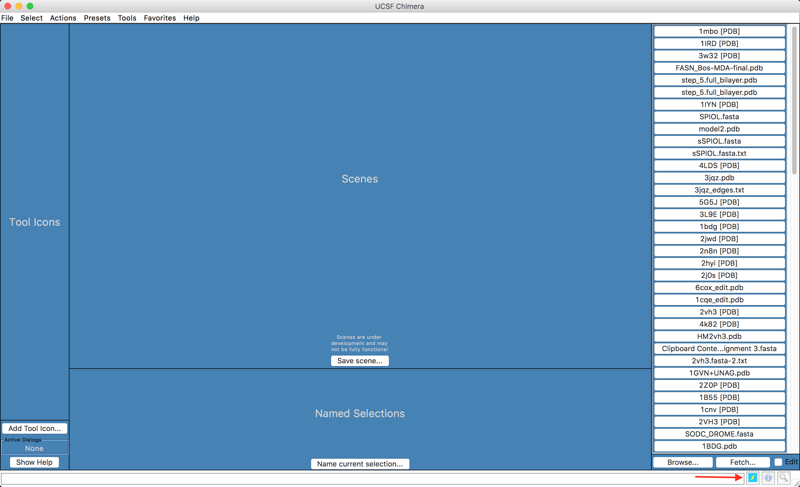

>*Caso uma tela preta apareça, clique no ícone marcado na figura acima.*

Vamos agora usar uma notação química simplificada, chamada de SMILES (*Simplified Molecular Input Line Entry System*), que serve para a representação de moléculas e reações.

> *Mais informações sobre o SMILES podem ser encontradas [AQUI](https://www.daylight.com/dayhtml/doc/theory/theory.smiles.html).*

Vamos construir uma molécula de água, usando o seguinte menu:

- *Tools... Structure Editing... Build Structure*

Na janela que aparecer clique em ```SMILES string``` e coloque **O** (letra O), como indicado na figura abaixo:


Identifique os átomos a partir de suas cores (Vermelho para o oxigênio e branco para o hidrogênio). Gire a molécula com o mouse e se familiarize com os comandos básicos de "zoom" e giro.

Vá em:

- *Actions... Atoms/Bonds...*.
- Neste menu, verifique as opções de visualização clicando em uma das opções abaixo:
	- *Stick, ball & stick, sphere, wire.*
- Identifique os átomos e as ligações, nos diferentes tipos de visualização.

A partir do site de informações sobre o [SMILES](https://www.daylight.com/dayhtml/doc/theory/theory.smiles.html) ou partir de buscas Google ou em bancos de dados de estruturas químicas (como o [PubChem](https://pubchem.ncbi.nlm.nih.gov)) procure pelo nome e desenhe outras moléculas do seu interesse. Por exemplo, vamos visualizar a estrutura da Aspirina®?

- Abra a página do [PubChem](https://pubchem.ncbi.nlm.nih.gov) e no campo de busca digite *"Aspirin"*.

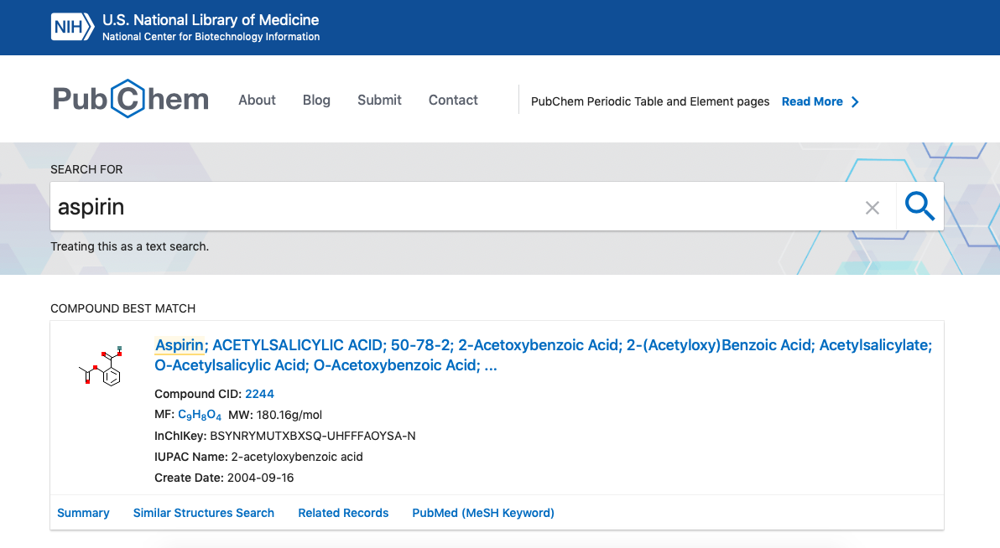

- Entre no registro retornado e na página de informações sobre o fármaco, procure o código Smiles, que estará no Campo "*Canonical SMILES*":

```shell
CC(=O)OC1=CC=CC=C1C(=O)O
```
- Cole o código SMILES da aspirina na caixa de diálogo ```Build Structure``` do UCSF Chimera.

O UCSF Chimera tem também o comando ```Fetch```, na sua janela inicial (a azul), canto inferior direito. Com ele podemos baixar estruturas diretamente dos principais bancos de dados estruturais. O código da molécula de aspirina no PubChem é 2244. Portanto na janela ```Fetch Structure by ID```, marque o banco PubChem e coloque o código, da maneira como representado na figura abaixo:

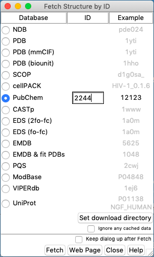

- Observe a representação da Aspirina, nos diferentes tipos de visualização. Veja outras moléculas lhe interessam.

>*Trabalharemos com os bancos de dados estruturais como o PubChem em mais detalhes em aulas posteriores durante a disciplina.*

## Visualizando os aminoácidos

As estruturas dos 20 aminoácidos proteicos (que estão codfificados no código genético) está denotada na figura abaixo:

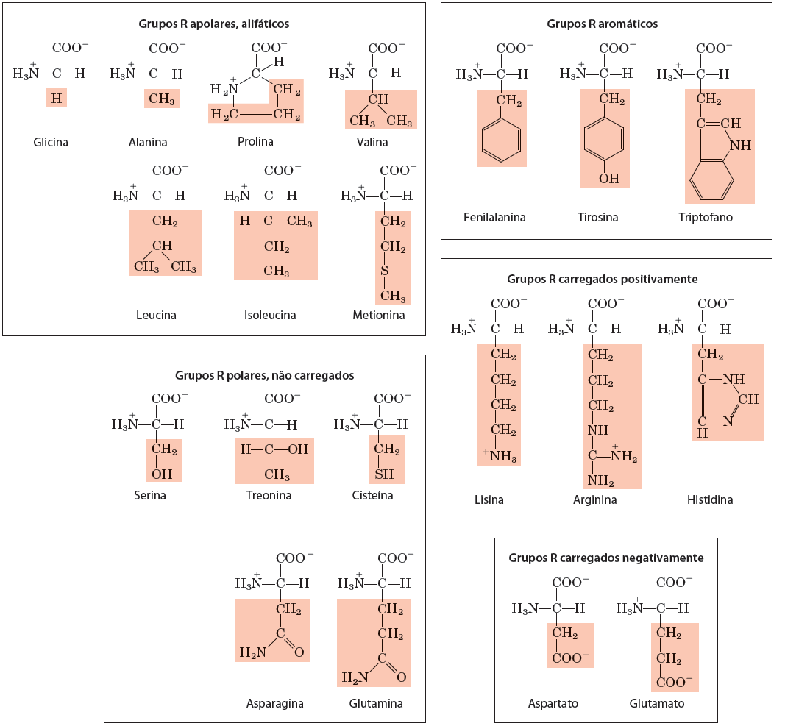

A tabela abaixo sumariza os códigos de 1 e de 3 letras destes aminoácidos:

| Aminoácido | Código de 3 letras | Código de 1 Letra |
|:-------|:--:|:--:|
| Alanina | Ala | A |
| Arginina | Arg | R |
| Asparagina | Asn | N |
| Aspartato | Asp | D |
| Cisteína | Cys | C |
| Glutamato | Glu | E |
| Glutamina | Gln | Q |
| Glicina | Gly | G |
| Histidina | His | H |
| Isoleucina | Ile | I |
| Leucina | Leu | L |
| Lisina | Lys | K |
| Metionina | Met | M |
| Fenilalanina | Phe | F |
| Prolina | Pro | P |
| Serina | Ser | S |
| Treonina | Thr | T |
| Triptofano | Trp | W |
| Tirosina | Tyr | Y |
| Valina | Val | V |

Você poder ver a fórmula individual de todos estes aminoácidos, usando o menu ```Build Structure``` do UCSF Chimera, clicando em peptide e colocando apenas um aminoácido, utilizando sempre o código de uma letra, como visto abaixo para o aminoácido Leucina (L):

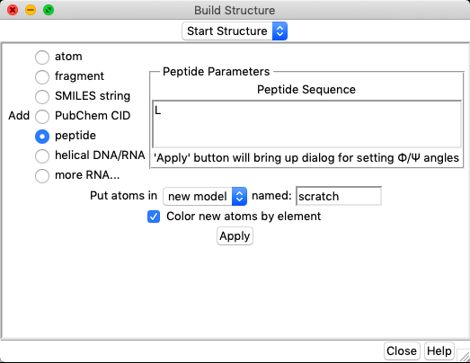

No entanto, veja as fórmulas de todos os aminoácidos de forma mais prática utilizando este [***Amino Acid Tutorial***](http://cbm.msoe.edu/markMyweb/3dmdJmols/aask/amino.html).

## Visualizando peptídeos e estruturas

Este exercício cobrirá os tipos básicos de estruturas de proteínas representados no banco [PDB](http://rcsb.org). O termo *fold* refere-se a um tipo global de arranjo de estruturas secundárias, como feixe de hélices-alfa ou um barril de folhas betas. Apesar de existirem milhares de estruturas experimentalmente determinadas, o número de *folds* únicos que essas proteínas adotam é limitado, e todas as proteínas podem ser classificadas em uma das categorias de *folds*, que são anotadas em bancos de dados como o CATH e o SCOP. No geral, funções semelhantes podem estar associadas a certos *folds* proteicos, e a classificação dos *folds* serve como uma ferramenta importante para entender a possível função de uma proteína.

- Abra o USCF Chimera.

### Construindo um peptídeo

Antes de visualizar estruturas inteiras, iremos agora visualizar a ligação peptídica entre 2 aminoácidos. Para isso, iremos construir alguns peptídeos no próprio Chimera. 

Iremos construir inicialmente o dipeptídeo formado pelos aminoácidos arginina (**R**) e aspartato (**D**). Para isso siga o menu abaixo:

- *Tools... Structure Editing... Build Structure*

Na janela que aparecer clique em ```peptide``` e no espaço indicado coloque **RD**, como indicado na figura abaixo:

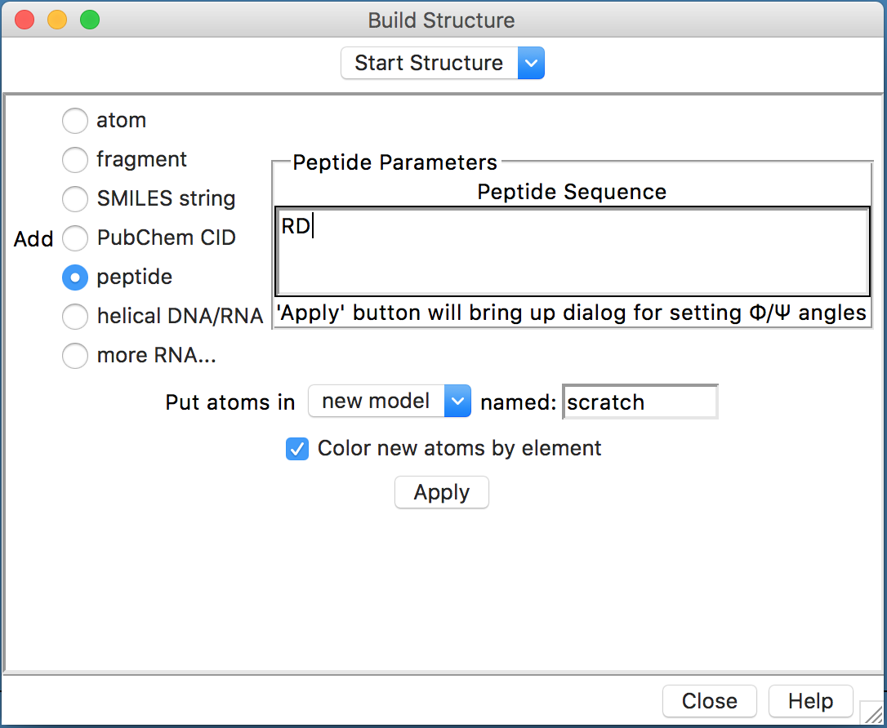

- No campo ```name```, dê um nome a molécula ou deixe o padrão.
- Clique em ```Apply```.
- Na janela que abrir em seguida, clique novamente em ```Apply``` e depois em ```Close```.

A molécula construída irá aparecer na janela principal. Ela estará sem os átomos de Hidrogênio. Para adicionar e facilitar a identificação, siga os passos abaixo:

- Siga o menu: *Tools... Structure Editing... AddH*
- Na nova janela que aparecer, no campo ```Protonation states for:```, selecione ```aspartic acid``` e deixe o restante das opções da forma como está.
- Clique em ```OK```. Os átomos de H deverão aparecer na cor branca.

>*Opções de protonação serão vistas posteriormente na disciplina.*

Para facilitar a visualização dos átomos e ligações, o seguinte comando pode ser executado:

- *Actions... Atoms/Bonds... ball & stick*

---
#### Exercícios

Com a estrutura do peptídeo **RD** aberta, identifique as porções/regiões da molécula listadas abaixo:

- N-terminal e C-terminal.
- Os grupos laterais (Grupos R) de cada aminoácido.
- A ligação peptídica.
- As ligações cujos ângulos de rotação são **ø** (*phi*) **Ψ** (*psi*).

---

### Verificando ângulos de rotação

Agora iremos trabalhar com o peptídeo RDQ, para visualizar as diferentes possibilidades dos ângulos de rotação **ø** (*phi*) **Ψ** (*psi*), e relacioná-los ao [Gráfico de Ramanchandran](https://en.wikibooks.org/wiki/Structural_Biochemistry/Proteins/Ramachandran_Plot). Para isso, siga os passos abaixo:

- *Tools... Structure Editing... Build Structure*

Na janela que aparecer clique em ```peptide``` e no espaço indicado coloque **RDQ**.

- No campo ```name```, dê um nome a molécula ou deixe o padrão.
- Clique em ```Apply```.
- Na janela que abrir em seguida, verifique os ângulos **ø** (*phi*) **Ψ** (*psi*) atribuídos por padrão no resíduo D (-57/-47). Clique novamente em ```Apply```, mas neste caso deixe esta janela aberta. A primeira molécula irá aparecer.
- Nesta mesma janela, você irá mudar os ângulos de rotação, da seguinte forma:
	- Você irá selecionar o resíduo D e nas caixas abaixo você irá colocar 0 graus, para ambos os ângulos *ø* e *Ψ*. Aperte a tecla ```Set```, verifique se os ângulos relativos ao resíduo D mudaram e aperte em ```Apply```.
	- Depois você irá selecionar o mesmo resíduo D e irá colocar os ângulos 57 e -47, para *ø* e *Ψ*, respectivamente. Aperte a tecla ```Set```, verifique se os ângulos relativos ao resíduo D mudaram e aperte em ```Apply```. (Veja a figura abaixo).

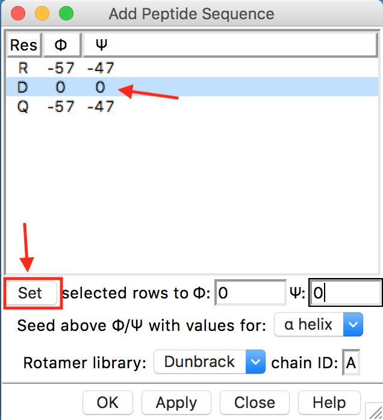

- Adicione os átomos de H para as 3 moléculas de acordo com o mostrado acima. Mude também as opções de visualização *Atoms/Bonds...* para sua visualização favorita.

As três moléculas irão aparecer sobrepostas. Agora vamos conhecer a *Model Panel* do UCSF Chimera:

- Clique em *Tools... General Controls... Model Panel* ou em *Favorites... Model Panel*.

A seguinte janela deverá aparecer:

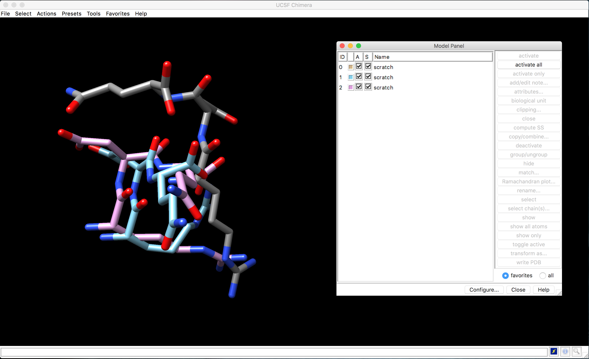

Quando se trabalha com mais de uma estrutura, esta janela serve para ativar/inativar e mostrar/ocultar os modelos que estamos trabalhando. Na janela podemos perceber os 3 peptídeos construídos, com a cor de cada um, e as colunas **A** e **S**, com uma caixa de seleção individual. Selecionando individualmente cada molécula, iremos organizar da maneira abaixo. Para movimentar a molécula na área de trabalho do Chimera, aperte o botão do meio do mouse ou *touch pad* (tecla ```option```em Macs). Disponha as moléculas da seguinte forma:

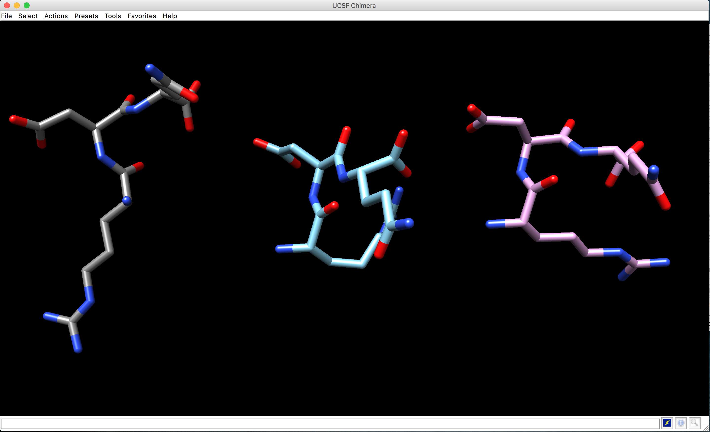

Verifique as sobreposições entre os átomos causadas pelos diferentes ângulos de torção em torno da ligação peptídica em torno resíduo D.

Agora iremos verificar o Gráfico de Ramachandran para os três peptídeos:

- Na janela *Model Panel*, selecione uma das 3 moléculas, e clique em ```Ramachandran Plot...```. Verifique o gráfico para todas as moléculas.

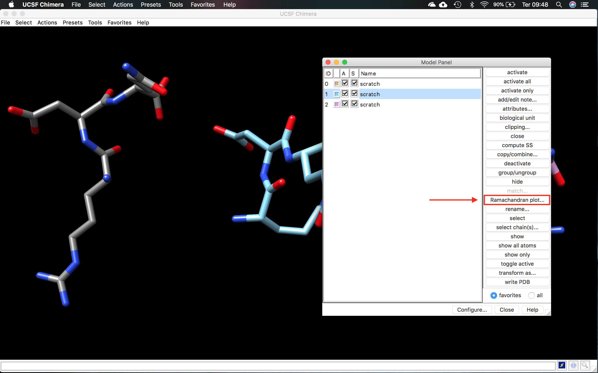

Agora vamos verificar os rotâmeros das cadeias laterais do aminoácido D (aspartato ou ASP). Para isso iremos:

Selecionar o resíduo nos 3 peptídeos:

- Clique em *Select... Residue... ASP*. Os aspartatos de cada modelo estarão selecionados.
- Vá agora em *Tools... Structure Editing... Rotamers*. Na janela que aparecer (*Choose Rotamers parameters*), o ASP deverá aparecer e depois clique em ```OK```.

### Clashes/Contatos

Até aqui você deve ter notado que existem ângulos de rotação *ø* e *Ψ* não permitidos devido a sobreposições entre os átomos da ligação peptídica ou dos que estão em torno dela. No UCSF Chimera, existe uma opção para verificar isto.

Vamos verificar esta função com o peptídeo 2 (#1 - *ø*/*Ψ* D = 0/0):

- Vá em *Select... Chain... A... scratch (#1)*
- Adicione os hidrogênios e coloque na sua forma de visualização preferida.
- Agora vá em *Tools... Structure Analysis... Find Clashes/Contacts*.
- Na janela que aparecer ***Find Clashes/Contacts***, coloque as opções da forma como a figura abaixo. O modelo deve estar selecionado e você deverá clicar em ```designate``` para o programa entender entre quais átomos ele deverá procurar sobreposições e contatos. Se você tiver selecionado apenas o peptídeo 2 (scratch  #1), 56 átomos deverão aparecer.

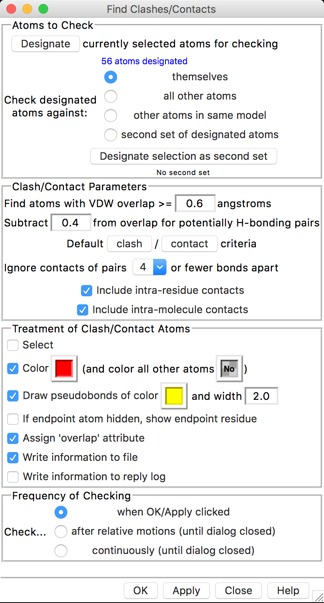

Todas as opções acima serão discutidas em sala de aula. Mas resumindo, os parâmetros pedem que os *clashes* sejam verificados entre os átomos, que todos os átomos envolvidos sejam coloridos diferencialmente e que um artigo de texto seja salvo com a descrição dos parâmetros e dos *clashes* e contatos.

- Clique em ```Ok```. Ele pedirá para salvar o arquivo ```overlaps``` em alguma pasta. É um arquivo de texto simples, portanto salve e depois abra em um editor de texto (tipo gedit).

O resultado final deverá ser similar ao mostrado na figura abaixo:


Os átomos envolvidos em *Clashes* estarão demarcados em vermelho. O conteúdo do arquivo ```overlaps``` deverá ser semelhante ao abaixo:

```
Allowed overlap: 0.6
H-bond overlap reduction: 0.4
Ignore contacts between atoms separated by 4 bonds or less
Detect intra-residue contacts: True
Detect intra-molecule contacts: True

3 contacts
atom1  atom2  overlap  distance
ARG 1.A O   GLN 3.A N   1.410  1.250
GLN 3.A CA  ARG 1.A O   1.061  2.239
ARG 1.A O   GLN 3.A CB  0.819  2.481
```

### Rotâmeros

As opções de conformação do resíduo de ASP serão mostradas na forma de linhas mais claras. Os ângulos diedrais, assim como suas respectivas probabilidades estarão descritos na própria janela dos rotâmeros (A figura abaixo demonstra apenas para o 1o peptídeo construído (#0)). O Chimera ao construir o peptídeo já colocar o rotâmero na sua posição mais provável para cada ângulo *ø* e *Ψ*.

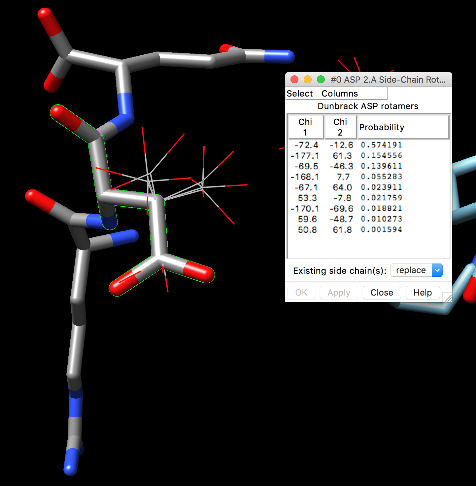

> *Na janela de rotâmeros você pode substituir o rotâmero original, mas não faremos isso agora.*

---

#### Exercícios

Com a estrutura do peptídeo **RDQ** aberta, identifique as porções/regiões da molécula listadas abaixo:

- N-terminal e C-terminal.
- Os grupos laterais (R) de cada aminoácido.
- A ligação peptídica.
- A ligação cujo ângulos de rotação **ø** (*phi*) **Ψ** (*psi*) você mudou.

Responda:

a) Você mudou a ***conformação*** ou a ***configuração*** destes peptídeos?

b) Explique por que os ângulos *ø* e *Ψ* na configuração 0/0 não é uma estrutura favorável.

c) Os ângulos *ø* e *Ψ* na configuração 57 e -47,respectivamente, é favorável? Explique.

Repita os passos para o peptídeo **RPQ** e explique os resultados obtidos, com os mesmos ângulos que você modificou para o peptídeo **RDQ**. Observe as diferenças da presença da prolina em relação: as regiões permitidas, *clashes*/contatos (sobreposições) e os rotâmeros das cadeias laterais.

## Estrutura Secundária 

Agora vamos abrir uma primeira estrutura completa.

- Clique em ```Fetch```.
- Na janela que apareceu, selecione o banco ```PDB``` e no campo digite [1ZIK](https://www.rcsb.org/structure/1ZIK).
- Clique em ```Fetch```.
- Mexa e observe as características desta estrutura.

Esta proteína é zíper de leucine formado por dois peptídeos.

> *Qual o tipo de estrutura secundária principal desta proteína?*

A exibição inicial padrão é fitas (ribbons). Para exibir também seus átomos, clique em:

- *Actions... Atoms/Bonds... show*.

O comando mostra todos os átomos e ligações na estrutura, exceto aqueles que na cadeia do peptídeo são suprimidos pela exibição da fita. Inicialmente, os heteroátomos (átomos além do carbono) são codificados por cores por elementos: oxigênio vermelho, azul de nitrogênio, etc. Os carbonos retêm a cor do modelo.

- Tente mover a estrutura com o mouse na janela principal de gráficos.

Agora vamos retirar a visualização em fitas:

- *Actions... Ribbon... hide* (Para mostrar apenas os átomos).

Identifique os aminoácidos, suas cadeias laterais e as ligações peptídicas.

Agora selecione uma das cadeias da estrutura 1ZIK e mostre as ligações de hidrogênio, com a opção:

- *Tools... Structure Analysis... FindHBonds*. Na janela que abrir em seguida, clique em ```Ok```.

Observe as ligações de hidrogênio que estabilizam a estrutura das alfa-hélices.

Feche a sessão do UCSF Chimera e vamos agora trabalhar com outra estrutura. Para isso, siga os passos abaixo:

- Clique em ```Fetch```.
- Na janela que apareceu, selecione o banco ```PDB``` e no campo digite [2N8N](https://www.rcsb.org/structure/2N8N).
- Clique em ```Fetch```.
- Mexa e observe as características desta estrutura.

Como se trata de uma estrutura obtida por Ressônancia Magnética Nuclear (RMN), você pode verificar que há cerca de 20 estruturas sobrepostas. Iremos trabalhar com apenas uma. Para isso faremos os seguintes passos:

- Vá em *Select... Chain... A... 2N8N (#0.1)*.
- Vá em *Select... Invert (all models)*.
- Apague as outras estruturas com a opção: *Actions... Atoms/Bonds... delete*.

Agora você deverá estar com apenas uma única estrutura. Vamos visualizar de forma diferenciada os tipos de estrutura secundária nesta estrutura:

- Vá em *Tools... Depiction... Color Secondary Structure*. Quais tipos de estrutura secundária você consegue visualizar?

Repita os passos acima para obter as ligações de hidrogênio para a estrutura 2N8N.

---
### Exercícios

a) Qual a diferença entre alfas-hélices e folhas beta?

b) Verifique o gráfico de Ramachandran para as estruturas 1ZIK e 2N8N e relacione com as zonas permitidas de cada tipo de estrutura secundária.

b) Do que depende a organização de uma determinada sequência em um tipo de estrutura secundária?


## Estruturas Terciária e Quaternária
 
A estrutura primária da insulina está representada na figura abaixo:


Vamos agora trabalhar com a estrutura terciária deste hormônio. Abra da forma acima indicada a estrutura [1ZEH](https://www.rcsb.org/structure/1ZEH).

Com ele aberto, identifique:

- As cadeias do hormônio insulina.
- Os tipos de estruturas secundárias envolvidas.
- Obtenha o gráfico de Ramachandran.
- Visualize as ligações de H.
- Localize e visualize as pontes dissulfeto (S-S).
> *Para este último item, a dica é procurar pelas cisteínas, de acordo com a figura abaixo.*

---
### Exercícios

Repita os passos acima com a estrutura [1MBO](https://www.rcsb.org/structure/1MBO). Descreva os resultados em um texto contínuo de no máximo 1 página discutindo:

- Qual é esta proteína? Qual sua função? É uma estrutura terciária ou quaternária?
- Quais os tipos de estrutura secundária que ela possui?
- Todos os ângulos de rotação estão dentro das regiões permitidas?


## Outras opções de Visualização do UCSF Chimera

Tutoriais também podem ser encontrados na página do Chimera ou no YouTube. 

- Exemplos:
	- [Tutoriais do UCSF Chimera](https://www.cgl.ucsf.edu/chimera/docs/UsersGuide/frametut.html).
	- [Playlist com os comandos básicos do UCSF Chimera](https://www.youtube.com/playlist?list=PLHib7JgKNUUeTZONxd0h0WBiZzAJmXmva) 
	- [Tutoriais básicos do banco PDBe](http://www.ebi.ac.uk/pdbe/docs/Tutorials/workshop_tutorials/IntroductionProteinStructures.html)

Com alguma estrutura aberta, veja as seguintes outras opções do UCSF Chimera.

Use o menu ```Favorites``` para mostrar a ```Side View``` (Vista lateral) para dimensionamento e recorte interativo. Esta opção mostra uma versão minúscula da estrutura. Na Vista lateral, tente mover a posição do olho (o quadrado pequeno) e os planos de corte (linhas verticais) com o botão esquerdo do mouse. Continue movendo e dimensionando a estrutura com o mouse na janela de gráficos e na Vista lateral conforme desejado ao longo do tutorial.

Quando o foco do mouse está na janela de gráficos (você pode precisar clicar nele se estiver interagindo com uma janela diferente), passe o cursor do mouse sobre um átomo, ligação ou segmento da fita sem clicar em nenhum botão. Informações de identificação em um balão *pop-up* irão aparecer. O balão desaparecerá quando o cursor for movido. Para um átomo, a informação do balão é da seguinte forma:

```
nome do resíduo	número do resíduo.cadeia  nome do átomo
```

Você pode ver pelos balões que essa estrutura contém duas cadeias peptídicas, A e B, e água (resíduos HOH), também com identificadores de cadeia A e B.

No Chimera, a seleção especifica átomos, ligações, resíduos, etc. para operações subsequentes com o menu Ações. As formas de fazer uma seleção incluem usar o menu Selecionar ou selecionar na tela. Várias ferramentas também fornecem maneiras especializadas de fazer seleções. O menu Ações se aplica ao que estiver selecionado, mas quando nada é selecionado, o menu Ações se aplica a tudo. Por exemplo, vamos colorir especificamente cada resíduo de Lisina:

- *Select... Residue... LYS* (Seleciona todos os aminoácidos lisina).
- *Actions... Color... hot pink* (aplicar a cor diferenciada).

Selecionar opções de menu também incluem ID da cadeia, elemento e muitas outras categorias de átomos e resíduos. Veja os comandos abaixo e se familiarize com eles. O resultado dos comandos é similar para qualquer programa de vizualização, apenas a localização deles na ferramenta é que muda.

- *Select... Chain... B* (seleciona a cadeia B).
- *Actions... Color... cyan* (aplicar a cor).
- *Actions... Ribbon... hide* (retira da representação de fitas).
- *Select... Structure... solvent* (seleciona molécula do solvente).
- *Actions... Atoms/Bonds... hide* (esconde os átomos selecionados)
- *Select... Chemistry... element... N* (escolhe os átomos de Nitrogênio).
- *Actions... Atoms/Bonds... sphere* (coloca os átomos na representação de esferas).
- *Select... Clear Selection* (limpa a seleção).
- *Actions... Atoms/Bonds... stick* (oloca os átomos na representação de varetas).
- *Actions... Ribbon... show* (Para mostrar novamente as fitas).
- *Actions... Focus* (centraliza a posição da molécula).

>*O UCSF Chimera não disponibiliza a opção "desfazer". Por isso é importante que você conheça bem as opções.*